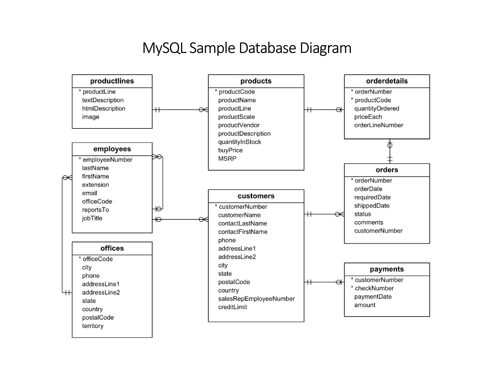

# 🗄️ MySQL Sample Database Diagram

## 🗄️ MySQL Sample Database Diagram (Portable Network Graphics[PNG] Version)

## 🗄️ MySQL Sample Database Diagram (Markdown Version)

### productlines

| Field           | Description |
| --------------- | ----------- |
| productLine     | Primary Key |
| textDescription |             |
| htmlDescription |             |
| image           |             |

**Relationships:**  
🔗 One-to-Many → products (via productLine)

---

### products

| Field              | Description                            |
| ------------------ | -------------------------------------- |
| productCode        | Primary Key                            |
| productName        |                                        |
| productLine        | Foreign Key → productlines.productLine |
| productScale       |                                        |
| productVendor      |                                        |
| productDescription |                                        |
| quantityInStock    |                                        |
| buyPrice           |                                        |
| MSRP               |                                        |

**Relationships:**  
🔗 Many-to-One → productlines  
🔗 One-to-Many → orderdetails

---

### orderdetails

| Field           | Description                        |
| --------------- | ---------------------------------- |
| orderNumber     | Foreign Key → orders.orderNumber   |
| productCode     | Foreign Key → products.productCode |
| quantityOrdered |                                    |
| priceEach       |                                    |
| orderLineNumber |                                    |

**Composite Primary Key:** (orderNumber, productCode)  
**Relationships:**  
🔗 Many-to-One → orders  
🔗 Many-to-One → products

---

### orders

| Field          | Description                            |
| -------------- | -------------------------------------- |
| orderNumber    | Primary Key                            |
| orderDate      |                                        |
| requiredDate   |                                        |
| shippedDate    |                                        |
| status         |                                        |
| comments       |                                        |
| customerNumber | Foreign Key → customers.customerNumber |

**Relationships:**  
🔗 Many-to-One → customers  
🔗 One-to-Many → orderdetails

---

### customers

| Field                  | Description                            |
| ---------------------- | -------------------------------------- |
| customerNumber         | Primary Key                            |
| customerName           |                                        |
| contactLastName        |                                        |
| contactFirstName       |                                        |
| phone                  |                                        |
| addressLine1           |                                        |
| addressLine2           |                                        |
| city                   |                                        |
| state                  |                                        |
| postalCode             |                                        |
| country                |                                        |
| salesRepEmployeeNumber | Foreign Key → employees.employeeNumber |
| creditLimit            |                                        |

**Relationships:**  
🔗 Many-to-One → employees (salesRepEmployeeNumber)  
🔗 One-to-Many → orders  
🔗 One-to-Many → payments

---

### payments

| Field          | Description                            |
| -------------- | -------------------------------------- |
| customerNumber | Foreign Key → customers.customerNumber |
| checkNumber    | Primary Key                            |
| paymentDate    |                                        |
| amount         |                                        |

**Composite Primary Key:** (customerNumber, checkNumber)  
**Relationships:**  
🔗 Many-to-One → customers

---

### employees

| Field          | Description                                   |
| -------------- | --------------------------------------------- |
| employeeNumber | Primary Key                                   |
| lastName       |                                               |
| firstName      |                                               |
| extension      |                                               |
| email          |                                               |
| officeCode     | Foreign Key → offices.officeCode              |
| reportsTo      | Foreign Key → employees.employeeNumber (self) |
| jobTitle       |                                               |

**Relationships:**  
🔗 Many-to-One → offices  
🔗 Self-referencing hierarchy via reportsTo  
🔗 One-to-Many → customers

---

### offices

| Field        | Description |
| ------------ | ----------- |
| officeCode   | Primary Key |
| city         |             |
| phone        |             |
| addressLine1 |             |
| addressLine2 |             |
| state        |             |
| country      |             |
| postalCode   |             |
| territory    |             |

**Relationships:**  
🔗 One-to-Many → employees

---

# Day 1 Tasks

| No. | Task                                                                                              | Filename                  | Table(s)                              |
| --- | ------------------------------------------------------------------------------------------------- | ------------------------- | ------------------------------------- |
| 1   | Count number of customers within each country                                                     | ./Day_1/task_complete.sql | customers                             |
| 2   | Find top 5 customers by highest creditLimit                                                       | ./Day_1/task_complete.sql | customers                             |
| 3   | Find top 5 customers by lowest creditLimit                                                        | ./Day_1/task_complete.sql | customers                             |
| 4   | Show customers with creditLimit = 0 and count them                                                | ./Day_1/task_complete.sql | customers                             |
| 5   | Find employees with office location in city `Tokyo`, country `Japan` (via officeCode)             | ./Day_1/task_complete.sql | offices & employees                   |
| 6   | Find employees with office code `5`                                                               | ./Day_1/task_complete.sql | offices & employees                   |
| 7   | Find employees with office code `5`, showing their `city` and `country`                           | ./Day_1/task_complete.sql | offices & employees                   |
| 8   | Show all employees, printing only: `employeeNumber`, `fullName` (using CONCAT), `country`, `city` | ./Day_1/task_complete.sql | offices & employees                   |
| 9   | Show total payment amount by each customer: `customerNumber`, `totalPaymentAmount`                | ./Day_1/task_complete.sql | customers & payments                  |
| 10  | Display customers with total quantity ordered                                                     | ./Day_1/task_complete.sql | customers & orderdetails (via orders) |
| 11  | Display customer name with total order value (`priceEach` × `quantityOrdered`)                    | ./Day_1/task_complete.sql | customers, orders & orderdetails      |

# Day 2 Tasks

| No. | Task                                                                                                                                                                                           | Filename                  | Table(s)                                 |
| --- | ---------------------------------------------------------------------------------------------------------------------------------------------------------------------------------------------- | ------------------------- | ---------------------------------------- |
| 1   | Display country-wise total payment amount                                                                                                                                                      | ./Day_2/task_complete.sql | customers & payments                     |
| 2   | Determine the total payment amount received from customers, grouped by the country of the sales offices handling those customers, and identify which countries have the highest total payments | ./Day_2/task_complete.sql | payments, customers, employees & offices |
